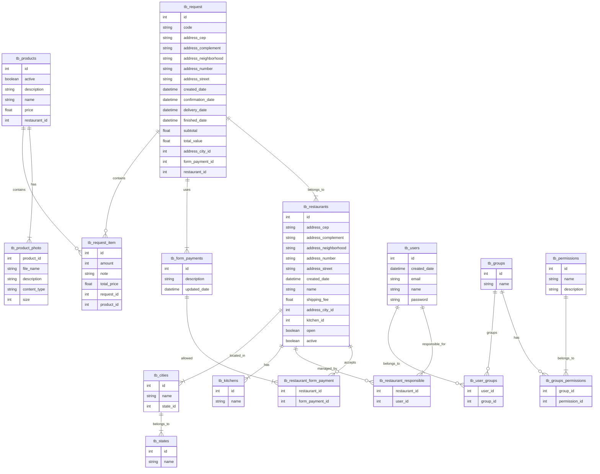

# Sistema de delivery de comida com Java e Spring Boot
<b>Este projeto foi criado com Java 17 e Spring Framework 3.0.0</b>

# Sobre o projeto

Este projeto consiste em uma aplicação Backend com Spring Boot para criar um sistema de delivery de comida completo com todos os recursos que o Spring disponibiliza.
O intuito deste projeto é servir de repositório base para consultas futuras de implementação de recursos do framework.

## Estrutura do projeto

| Pasta  | Descrição                                                 |
|--------|-----------------------------------------------------------|
| `app`  | Contém o projeto **Spring Boot**, incluindo a API e lógica de negócio. |
| `infra` | Contém os arquivos **Terraform** para provisionar a infraestrutura na AWS. |


# Diagrama entidade relacionamento (banco de dados)




## Branches de referência - Desenvolvimento

Para garantir um versionamento estruturado e documentar o uso de cada recurso, dividi o projeto em branches específicas, servindo como referência para a aplicação de funcionalidades.

| Branch                        | Descrição                                                                                               |
|-------------------------------|---------------------------------------------------------------------------------------------------------|
| `master`                      | Projeto completo                                                                                        |
| `feat/crud-basic`             | Implementação de um CRUD da forma mais básica.                                                          |
| `feat/crud-service`           | Implementação do CRUD com a camada de serviço.                                                          |
| `feat/crud-repository-jpa`    | Implementação de recursos do JPA e padrão repository.                                                   |
| `feat/migrations-flyway`      | Implementação do Flyway para criar as migrações.                                                        |
| `feat/custom-exception-handle`| Implementação de tratamento e modelagem de erros da API.                                                |
| `feat/include-patterns`       | Inclusão de DTO's e Mappers nos CRUD's para aplicação de boas práticas.                                 |
| `feat/advanced-api`           | Modelagem avançada de API's usando sub-recursos para relacionamento, granularidade de recursos e conceitos abstratos e não-CRUD. |
| `feat/search-reports-projections` | Implementação de pesquisas, relatórios e projeções no sistema.                                          |
| `feat/upload-download-files`  | Implementação de download e upload de arquivos com AWS S3 e armazenamento local.                        |
| `feat/send-transactional-email`| Implementação de envio de emails transacionais com AWS SES.                                             |
| `feat/api-client-js-java`     | Implementação de cache e otimizações gerais para consumo do cliente.                                    |
| `feat/implements-api-docs`    | Documentação da API com Swagger OpenAPI 3 (legado).                                                            |
| `feat/discoverability-hateoas`| Implementação de descoberta e HATEOAS no modelo HAL com Spring Hateoas                                  |
| `feat/version-api`| Implementação de versionamento de API por URI, mantendo v1 para as APIs existentes e criando v2 para o novo recurso de cozinhas, visando melhor organização e evolução das funcionalidades sem quebrar compatibilidade com a versão anterior.                                  |
| `feat/logging`| Implementação de logs com logback e SLF4J e configuração de dependência e propriedades para salvar logs na nuvem com Loggly     |

# O que você precisa saber antes de rodar o projeto

## Configuração de credenciais AWS
Este projeto utiliza recursos da AWS, como S3 (para armazenamento de arquivos) e SES (para envio de e-mails). Por questões de segurança, as chaves de acesso não podem ser incluídas diretamente no código. Portanto, é necessário que o usuário crie suas próprias chaves de acesso antes de rodar o projeto em sua máquina.
### Gerando credenciais AWS

1. Acesse o [Console da AWS](https://aws.amazon.com/console/).
2. Navegue até o serviço **IAM** (Gerenciamento de Identidade e Acesso).
3. Crie um novo **Usuário** com permissões para o S3 e SES.
4. Gere um par de **Access Key** e **Secret Key**.
5. Configure essas chaves no arquivo `application.properties` do seu projeto, substituindo as chaves de exemplo pelos valores gerados.

```properties
algafood.storage.type=s3

# Configurações de Armazenamento
algafood.storage.local.directory-photos=src/main/java/br/com/thallyta/algafood/files
algafood.storage.s3.access-key=sua-chave-de-acesso-aqui
algafood.storage.s3.secret-key=sua-chave-secreta-aqui
algafood.storage.s3.bucket=algafood-api-test-00254
algafood.storage.s3.region=us-east-2
algafood.storage.s3.folder=catalogo

# Configurações de E-mail (AWS SES)
spring.mail.host=email-smtp.us-east-2.amazonaws.com
spring.mail.port=587
spring.mail.username=sua-chave-de-acesso-aqui
spring.mail.password=sua-chave-secreta-aqui
algafood.mail.sender=seu-email-aqui@gmail.com

```

## Configurando Loggly para o Projeto

Para habilitar o envio de logs para o Loggly, siga os passos abaixo:

### 1. Criar uma Conta no Loggly
1. Acesse [Loggly](https://www.loggly.com/).
2. Faça o cadastro para criar sua conta ou faça login, caso já possua uma.

### 2. Gerar o Token de Autenticação
1. Após o login, vá até o painel do Loggly.
2. Navegue até **Source Setup** e selecione a opção **Customer Tokens**.
3. Clique em **Generate Token** para criar um novo token de autenticação.
4. Copie o token gerado, pois ele será necessário nas etapas seguintes.

### 3. Configurar o Token no Projeto

1. No arquivo `application.properties` do seu projeto, adicione a seguinte propriedade, substituindo `seu-token-logging-aqui` pelo token gerado no Loggly:

     ```properties
    logging.loggly.token=seu-token-logging-aqui
    ```
    
3. Salve o arquivo.

### 4. Verificar a Configuração
1. Execute o projeto e monitore os logs.
2. Acesse o painel do Loggly para confirmar se os logs estão sendo enviados corretamente.

# Iniciando o projeto

Para iniciar a aplicação execute a seguinte ação na pasta algafood

```shell script
mvn spring-boot:run
```

Instale as dependências do maven com o comando:

```shell script
mvn clean install
```

Consultar documentação da Api:

```shell script
http://localhost:8080/swagger-ui/index.html#/
http://localhost:8080/v3/api-docs
```

## Configuração da Infraestrutura com Terraform

### Push de Imagem para o ECR

#### Passo 1: Rodar o Terraform
Execute os comandos abaixo para aplicar a infraestrutura na AWS usando Terraform:

```sh
terraform init
terraform apply -auto-approve
```

#### Passo 2: Acessar o ECR no Console da AWS
Após rodar o Terraform, entre no console da AWS:
1. Navegue até **Elastic Container Registry (ECR)**.
2. Encontre o repositório criado pelo Terraform.
3. Copie os comandos exibidos na seção **View push commands**, que serão utilizados para autenticar no ECR, criar a imagem e fazer o push.

#### Passo 3: Autenticar no ECR e Fazer o Push da Imagem
Execute os comandos indicados no AWS ECR para:
1. Autenticar no ECR.
2. Criar a imagem do container.
3. Fazer o push da imagem para o repositório ECR.

Exemplo de comandos (substitua `<aws-account-id>`, `<region>` e `<repository-name>` pelos valores apropriados):

```sh
aws ecr get-login-password --region <region> | docker login --username AWS --password-stdin <aws-account-id>.dkr.ecr.<region>.amazonaws.com

docker build -t <repository-name> .

docker tag <repository-name>:latest <aws-account-id>.dkr.ecr.<region>.amazonaws.com/<repository-name>:latest

docker push <aws-account-id>.dkr.ecr.<region>.amazonaws.com/<repository-name>:latest
```

Após o push, a imagem estará disponível no ECR para ser utilizada na execução do container na AWS.


# Autor
<b>Thallyta Macedo Carvalho de Castro</b>

Linkedin: https://www.linkedin.com/in/thallyta-castro/

Medium: https://medium.com/@thallyta-castro-cv

email: thallytacastro.dev@gmail.com
